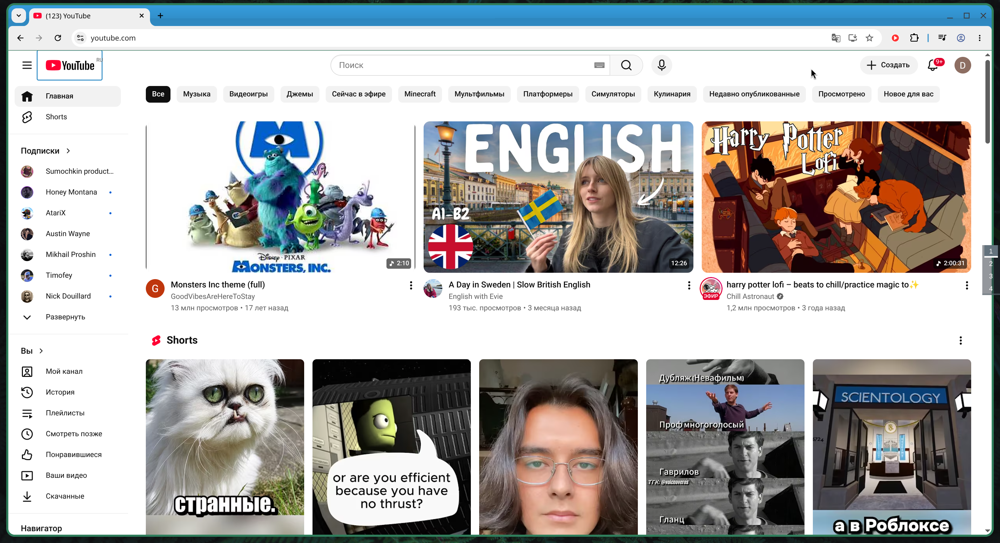
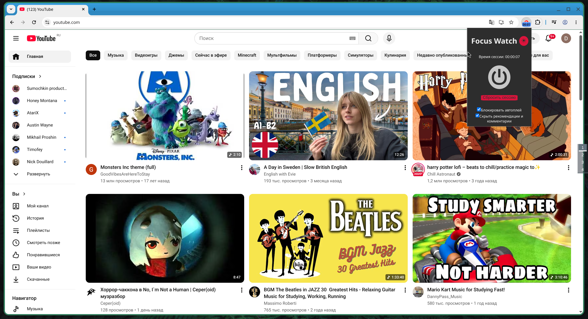
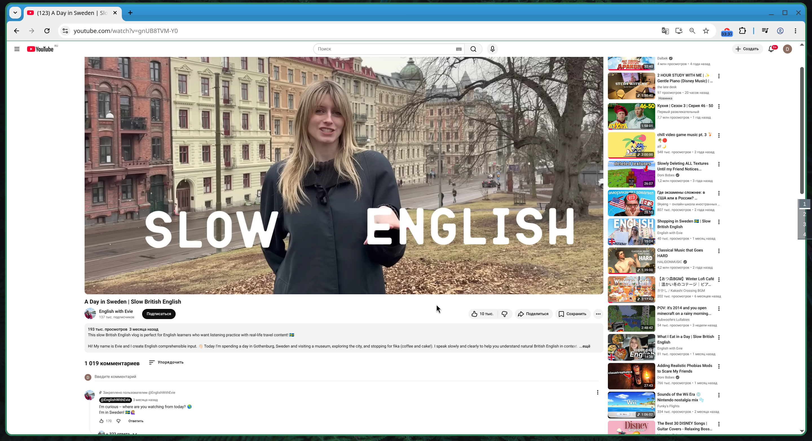
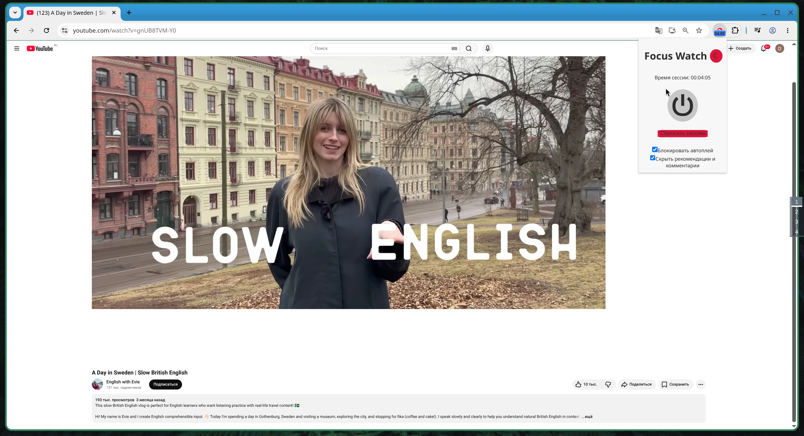
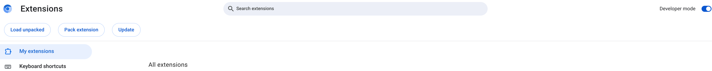

# focus-watch
Проект фокусировки просмотра Ютуба для собеседования на работу.

## Описание
Проект выполнен на Node.js версии 26.2.0.

Разбор ошибок проведён в конце файла.

При разработке был использован существующий шаблон `npx` для упрощения изучения разработки расширений:
``` bash
npx extn create focus-watch --template react-ts
```

Ветка итогового результата проекта - `main`

## Работа расширения
В основном для того, чтобы скрывать необходимые по заданию блоки, были использованы пользовательские стили, которые подключаются в процессе работы расширения. 

Использование стилей обусловлено тем, что они позволяют менять состояние страницы без перезагрузки.

При активации расширения все упоминания о Shorts скрываются на любой странице YouTube (Главная, Поиск, страницы каналов, История и т.п.) благодаря селекторам:
- a[href*="/shorts/"];
- ytd-rich-section-renderer;
- ytd-reel-shelf-renderer;
- grid-shelf-view-model;
- [title*="Shorts"];
- [tab-title*="Shorts"];
- [aria-label*="Shorts"].

При переключении галочки "Скрыть рекомендации и комментарии" (реализация мягкого режима) на странице просмотра скрываются селекторы:
- #comments;
- #secondary.

*Скрытие комментариев было добавлено по той причине, что расширение разрабатывалось в том числе и "под себя", планируется его дальнейшее использование в повседневной жизни. А соответственно на практике комментарии зачастую перенимают внимание при просмотре видео.*

При переключении галочки "Блокировать автоплей" скрывается единственный селектор - `[data-tooltip-target-id*="ytp-autonav-toggle-button"]`. А для непосредственной блокировки переключается режим кнопки автоплея на "отключено".

Кнопка "Сбросить сессию" удаляет созданные стили и сбрасывает таймер.

При смене любой вкладки ютуба на другой сайт таймер останавливается, но режим сохраняется. При возвращении на любую вкладку ютуба - таймер продолжает работу, если режим фокуса включен.

Можно сменить тему расширения на тёмную или светлую по нажатию кнопки рядом с заголовком.

## Скриншоты
Будет показан базовый функционал, т.к. остальное можно будет увидеть на практике.



Главная без запуска расширения



Главная с запуском расширения



Страница просмотра без запуска расширения



Страница просмотра с запуском расширения

Можно заметить, что плеер немного съехал. В основном это из-за того, что масштаб страницы был установлен для демонстрации функционала на 120%. При 100% такого поведения не наблюдается. Артефакт исчезает при перезагрузке страницы.

## Запуск в режиме разработчика
Для запуска расширения в режиме разработчика в корне проекта необходимо выполнить команду:
``` bash
npm run dev
```

Автоматически должен будет запуститься браузер Chrome или Chromium с уже установленным расширением.

## Установка в браузер для повседневного использования
Для сборки расширения необходимо выполнить команду:
``` bash
npm run build
```
В директории dist/ появится результат сборки, который нужно будет установить в браузер.

Для установки необходимо включить режим "Developer mode" и нажать "Load unpacked".



После этого будет представлено диалоговое окно с предложением выбрать директорию. Необходимо выбрать директорию dist/, созданную ранее.

## Комментарий
Проект так же, как и file-upload, было очень интересно выполнять, т.к. никогда не сталкивался с разработкой расширений. Его реализация прошла заметно быстрее, т.к. опыт использования TypeScript и React уже был приобретён.

Однако непосредственно из-за отсутствия опыта в разработке расширений, код, объективно говоря, превратился в спагетти. Его тяжело поддерживать.

Если выделить дополнительное время - оно было бы потрачено на структуризацию и оптимизацию кода.

Также замечено, что иногда при длительном отсутствии действий, service worker засыпает. Однако правильное решение проблемы найти не удалось.

## Разбор ошибок
### 1. Таймер стартует вне YouTube после перезапуска браузера
Было исправлено при отработке пункта 8. Теперь функция startTimer не выполняется, если пользователь находится вне ютуба.

### 2. Тёмная тема не сохраняется
Исправлено.

### 3. onInstalled может затереть настройки пользователя
Исправлено. Добавлена проверка на наличие существующих значений в хранилище. При отсутствии - зануляются.

### 4. Селектор ytd-rich-section-renderer слишком широкий
Исправлено. ytd-rich-selection-renderer заменён на ytd-rich-shelf-renderer.

### 5. Related на /watch завязаны на чекбокс, а не только на режим фокуса
Исправлено. Нужно лучше чувствовать логику UI/UX. xD Главное подумал о том, что не стоит называть переключатель "Мягкий режим" и лучше указать краткий функционал, но не подумал о базовом функционале расширения.

### 6.

### 7. В репозитории нет иконок и скриншотов
Локальная ошибка, пропускаю.

### 8. Нельзя выключить фокус вне YouTube
Исправлено. На самом деле странное решение принял в этом плане: в тот момент думал, что это логично, если пользователь не сможет отключать режим вне вкладок ютуба, а сможет только сбрасывать режим.

### 9. Прочее
* Удалено. Не заметил этой настройки. В файле изменил только исполнение content_scripts на url, которые относятся к ютубу. Настройка уже была установлена в шаблоне. Теперь знаю, что она необходима для внедрения на сайт каких-либо функций из расширения.
* Удалено. Файл и тесты подгрузились вместе с использованным шаблоном.
* Удалено. Файл также был подгружен вместе с использованным шаблоном, но были какие-то проблемы в использовании, из-за чего по итогу тип chrome был установлен через npm.